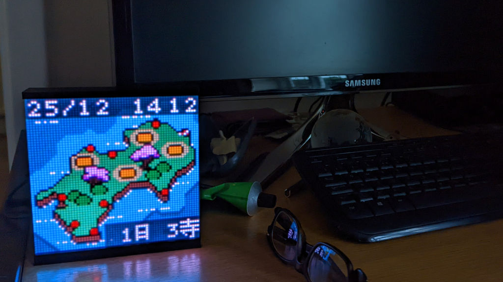

# walkclock



A clock that shows a map with a route that progresses day-by-day.

Display is a 64x64px LED matrix, driven by an STM32H743 on a WeAct dev board.

## Simulator

To run the simulator on a desktop:

```
cd simulator/
cargo run --release
```

The following keyboard buttons are mapped to the buttons on the hardware:

* Q/Backspace/Up: BACK
* W: QR
* E: DISPLAY
* A/Enter/Down: ENTER
* S/Left: LEFT
* D/Right: RIGHT

## Firmware

To program the firmware:

```
cd firmware/
cargo embed --release
```

Use `cargo embed --release rtt` to also attach an RTT session.

## Other Assets

* `mechanical/` contains design files for the 3d-printed holder and laser-cut
  acrylic diffuser
* `artwork/` contains the various maps and images, and a script to extract
  route pixel data from XCF files
